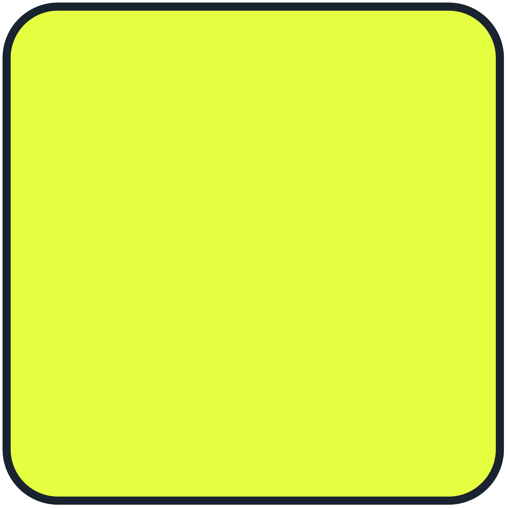

## Hello, I'm Pen.
An IT Fresh Graduate and work across `UI/UX Designer,` `Creatives,` `Software Development,` and `3D Models` while continuously building my skills in full-stack development up to **Software Engineering** or **DevOps.**

## Current Tech-Stack
      
### Frontend

   
   
   
   
   

      
### Backend & Database

   
   
   

      
### Tools

   
   
   
   

      
### Creative Software Tools

   
   
   
  

